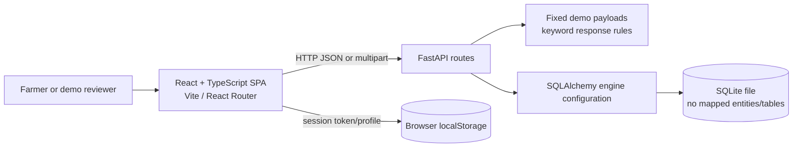
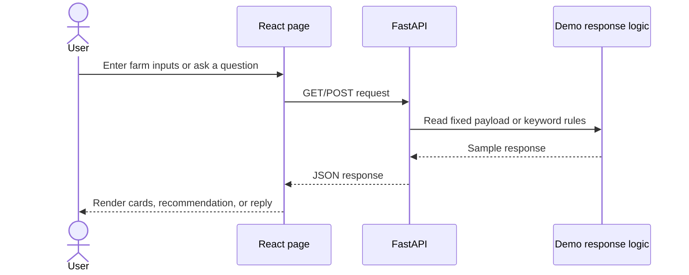
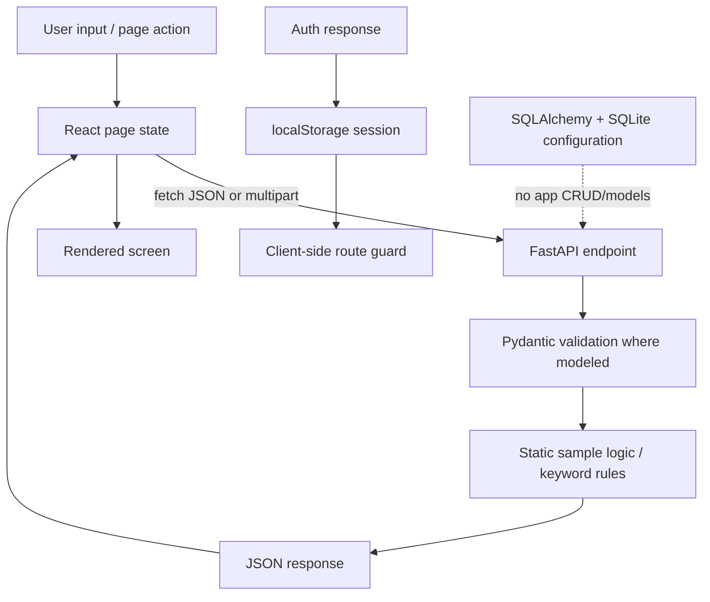

# 1. Project Overview

- **Project name:** AgriMitra AI
- **Purpose:** A demo-first web application that presents farm information and sample decision-support guidance for crop planning and day-to-day farm decisions.
- **Problem addressed:** Farm decisions involve scattered information about crops, weather, soil, crop health, markets, and timing. The project presents these topics together in one interface.
- **Target users:** Farmers, agriculture students, project evaluators, and demonstration audiences. The current build is a sample-data prototype, not a production farm-management service.
- **Main objectives:**
  - Present a consolidated farm dashboard and farm profile.
  - Demonstrate crop recommendations using field and seasonal inputs.
  - Show weather, market, crop-calendar, crop-health, knowledge, and reporting screens.
  - Demonstrate a conversational assistant and sample alerts.
  - Keep the application runnable without third-party keys or trained model files.
- **Key benefits:** A single navigable interface, visible decision-support examples, optional soil-report flow, and a clear starting point for later integration with real agricultural services.

> **Data qualification:** Most values and recommendations are hard-coded demonstration data. The application does not currently connect to live weather/market providers, sensors, or trained AI/ML models. Treat all displayed guidance and scores as illustrative rather than agronomic advice.

# 2. Problem Statement

Farmers make interdependent choices about crop selection, water use, disease monitoring, seasonal activities, and market timing. Relevant information may be spread across separate sources or require specialist interpretation. AgriMitra AI demonstrates how these kinds of information can be grouped into one web application and presented as practical prompts.

The project is useful as a prototype and educational demonstration because it gives a reviewer a connected view of farm information and sample actions. Its current data is not sufficiently dynamic or validated for operational decisions: it does not ingest live farm measurements, external forecast data, verified prices, or trained inference results.

# 3. Proposed Solution

AgriMitra AI provides a React single-page interface backed by a FastAPI service. The user can open the public landing page, use the demo login or registration flow, review a sample onboarding profile, and navigate the protected UI modules. The modules request sample JSON from the backend, or in a few cases use local demo content, and render it as farm metrics, guidance, timelines, market comparisons, or report sections.

The current user journey is:

1. Open the landing page and choose Login or Get Started.
2. Submit the demo login or registration form. The API returns a fixed demo token and demo farmer profile.
3. Review the onboarding stepper. Its edits are held in component state and are not saved to the backend.
4. Open the dashboard and other modules, which display fixed demonstration data.
5. In Crop Recommendation, choose whether a soil test report is available. Without a report, N, P, K, and pH remain unavailable and the result is labeled preliminary. With a report, the UI accepts PDF/image/TXT/CSV files, but only TXT/CSV contents are parsed by the current browser code; PDF/image OCR is not implemented. Values can be edited before the request, but the backend currently returns predefined crop recommendations regardless of those values.
6. Use the assistant, crop doctor, crop calendar, and reports as demonstrations of their respective workflows.

# 4. Key Features

## Dashboard and sample analytics
- **What it does:** Shows demo farmer context, farm-health and field metrics, weather summary, recommendation copy, task list, market summary, alerts, and four trend charts.
- **Why useful:** Demonstrates how farm signals could be brought together for scanning and prioritization.
- **How to use:** Sign in and open Dashboard. The chart range selector switches among 7-day, 30-day, and 3-month arrays.
- **Implementation note:** Metric payloads are generated by fixed backend dictionaries. The 30-day and 90-day chart series are also frontend constants, not historical observations or calculated analytics.

## My Farm
- **What it does:** Displays the sample farmer/farm profile and operational metrics by combining `/api/profile` and `/api/dashboard`.
- **Why useful:** Presents a compact farm overview.
- **How to use:** Open My Farm from the sidebar.
- **Implementation note:** The current page is read-only. There is no farm create/edit/delete form and profile data is not persisted.

## Soil information and soil-report flow
- **What it does:** The Crop Recommendation form asks whether a soil test report is available. It accepts `.pdf`, `.png`, `.jpg`, `.jpeg`, `.webp`, `.txt`, and `.csv` file selections. TXT/CSV text is scanned for simple label/value patterns for nitrogen, phosphorus, potassium, and pH. The farmer can edit the resulting fields before requesting a recommendation. No-report fields display “Not available,” and a soil-testing information section names recognized laboratories, agricultural universities, Krishi Vigyan Kendras, and agriculture department services.
- **Why useful:** Does not require farmers to know NPK/pH values when they do not have a soil test.
- **How to use:** Choose Yes and select a file, then review/edit any detected values; or choose No and continue with known field details.
- **Important limitation:** PDF/image contents are not OCR-extracted. For those formats, values stay “Not available.” The file is not uploaded to the backend or saved. The frontend sends the filename/source label and entered numeric values in the recommendation JSON, but the current recommendation handler does not use those values in crop selection. If Yes is selected, the API response labels the result as based on an uploaded soil report even if the file had no machine-readable extraction; this is a demo-flow label, not proof that the backend analyzed the report.

## Crop Recommendation
- **What it does:** Collects soil type, temperature, humidity, rainfall, season, and water availability, alongside optional soil-report values, and displays a recommended crop with suitability, reasons, crop facts, and alternatives.
- **Why useful:** Demonstrates an input-to-recommendation interaction without requiring NPK/pH entry.
- **How to use:** Complete the available fields and select Generate recommendation.
- **Implementation note:** The FastAPI handler returns a fixed Tomato / Chilli / Groundnut recommendation list and fixed scores. User inputs do not alter the selected crop or scores. The response identifies itself as demo/rule-based fallback data.

## Weather
- **What it does:** Displays current conditions, a seven-day sample forecast, and farming-impact guidance for irrigation, spraying, disease risk, and rain risk.
- **Why useful:** Shows how weather conditions could be translated into farm actions.
- **How to use:** Open Weather from the sidebar.
- **Implementation note:** `/api/weather` returns fixed demonstration values; there is no external weather-provider integration.

## AI Crop Doctor / Disease Detection
- **What it does:** Accepts a browser-selected image, shows a preview, submits multipart form data, and renders a diagnosis, confidence, symptoms, causes/actions, and prevention guidance.
- **Why useful:** Demonstrates a crop-health issue reporting workflow.
- **How to use:** Select a leaf image, choose Analyze, and review the returned content.
- **Implementation note:** The backend always returns a predefined Early Blight response and does not inspect the image or run an image model. The reported confidence is illustrative.

## AI Assistant
- **What it does:** Provides suggestion buttons and a message form; renders user and assistant messages in a local chat window.
- **Why useful:** Demonstrates a conversational interface for common farm questions.
- **How to use:** Choose a prompt or type a question and press Send.
- **Implementation note:** The backend selects response templates using keyword checks such as “crop,” “irrigate,” “disease,” “rain,” and “fertilizer.” It is not connected to an LLM. Conversation history is not stored; the GET history endpoint exists but the page does not request it.

## Crop Calendar
- **What it does:** Displays a crop stage timeline and recommended activities. The selector offers Tomato, Chilli, and Groundnut.
- **Why useful:** Demonstrates stage-oriented planning and activity reminders.
- **How to use:** Open Crop Calendar and select a crop.
- **Implementation note:** The API provides one fixed Tomato timeline. Changing the selector changes the heading but does not load a crop-specific timeline. The task POST endpoint only echoes a task and is not wired to a task-creation control in the UI.

## Alerts and insights
- **What it does:** Dashboard displays sample alerts, and the backend exposes notifications and insight lists.
- **Why useful:** Demonstrates a place for weather, crop, disease, and market notices.
- **How to use:** Review Smart Alerts on the dashboard. The header bell is currently a visual control only; it does not open a notification view or update read state.
- **Implementation note:** Alerts, insights, and notifications are fixed sample entries.

## Market Intelligence
- **What it does:** Displays one crop price, one location, sample demand, a price trend, and market comparisons.
- **Why useful:** Demonstrates how users could compare market signals.
- **How to use:** Open Market from the sidebar.
- **Implementation note:** Values are hard-coded demo data, not a verified live price feed.

## Knowledge Hub
- **What it does:** Displays local learning cards, one selected insight panel, and FAQ content from the backend.
- **Why useful:** Provides brief educational material alongside decision screens.
- **How to use:** Select a learning card and review the FAQ.
- **Implementation note:** This is static educational copy and sample FAQ data; there is no content-management service.

## Reports
- **What it does:** Displays a sample farm summary, report-section labels, and report detail blocks. The button calls `window.print()` to let the browser print or save the page as PDF.
- **Why useful:** Demonstrates a printable farm summary.
- **How to use:** Open Reports and choose Download Report as PDF, then use the browser print dialog.
- **Implementation note:** No PDF-generation backend exists. The soil analysis text on the page includes a fixed pH/nutrient statement and is demo copy, not measured or report-derived soil data.

## Landing, login, registration, and onboarding
- **What it does:** Provides the public landing page, login and registration forms, and a four-step onboarding form.
- **Why useful:** Demonstrates a complete-looking entry journey for a prototype.
- **How to use:** Start at `/`, choose Login or Get Started, then navigate through onboarding after the API response.
- **Implementation note:** Backend auth is demo-only and returns a static token/profile. Login accepts the demo email or any non-empty password due to its current condition; registration does not create a persisted account. Onboarding state is not sent to the API. Client-side protected-route state is stored in browser `localStorage` under `agrimitra-session`.

# 5. System Architecture

The frontend is a React 18 + TypeScript single-page application built by Vite and routed with React Router. It calls a FastAPI application using JSON `fetch` requests, with multipart form data for disease detection. The FastAPI routes mostly return fixed demo dictionaries. SQLAlchemy is configured with a SQLite default, but no ORM entities or application CRUD operations are defined. The app does not currently use a trained model or external agricultural service.



## Data flow



**Authentication:** There is no backend authorization middleware. Frontend route guards check whether a session object exists in local storage. API endpoints themselves do not require a bearer token.

**External services:** No live weather, mandi, map, email, LLM, image-analysis, or soil-lab service is called by the source code.

# 6. Technology Stack

| Technology | Purpose |
|---|---|
| TypeScript | Frontend application language and type checking |
| React 18 | Component-based user interface |
| Vite 5 | Frontend development server and production bundler |
| React Router 6 | Client-side routes and route nesting |
| Framer Motion | Layout/page entrance animation |
| CSS | Custom design system and responsive styling; no CSS framework is configured |
| Python 3.12 recommended | Backend runtime used by the checked setup and Docker image |
| FastAPI | HTTP API and request handling |
| Pydantic 2 | Request-body schema validation |
| Uvicorn | ASGI development/runtime server |
| SQLAlchemy 2 | Database engine/base initialization; currently no mapped application entities |
| SQLite | Default configured database dialect |
| python-multipart | Multipart request parsing for disease image endpoint |
| Docker / Docker Compose | Local container build/run configuration |

No trained ML library, frontend component library, weather API client, OpenAI client, or cloud deployment provider is present in the declared dependencies/configuration.

# 7. Application Modules

## Dashboard
Dashboard metrics, sample recommendation text, alerts, weather summary, market snapshot, task list, and synthetic trend charts. Data source: `GET /api/dashboard` plus local chart series for some ranges.

## My Farm
Read-only sample farm/profile overview. Data source: `GET /api/profile` and `GET /api/dashboard`.

## Soil Health
There is no standalone Soil Health route. Soil type and optional soil-report values are part of Crop Recommendation; sample soil information also appears on My Farm and Reports. The report upload is not persisted or OCR processed for PDF/image formats.

## Crop Recommendation
Collects optional field context and requests `/api/crop-recommendation/recommend`. The current backend selection is predefined and does not score from request values.

## Weather
Displays current/forecast conditions and action guidance from `GET /api/weather`. The source is marked “Demo weather fallback.”

## AI Assistant
Keyword-template chat at `POST /api/chat`; `GET /api/chat` returns a static example history but is not used by the page.

## Crop Calendar
Fixed timeline and activities from `GET /api/calendar`. The selected crop does not change returned timeline data.

## Alerts
Dashboard alert list and separate `GET /api/notifications` / `GET /api/insights` payloads. The notification bell itself is not wired to an interactive panel.

## Analytics
Dashboard trend charts. Values are fixed example arrays and do not represent stored time-series observations.

## Reports
Sample report summary from `GET /api/reports`; browser printing via `window.print()`.

## Market
Sample mandi information and price comparisons from `GET /api/market`.

## AI Crop Doctor
Multipart image submission to `/api/disease-detection/analyze`; current diagnosis response is predetermined and not produced by visual inference.

## Knowledge Hub
Static learning cards in the frontend and sample FAQ/featured data from `GET /api/knowledge`.

## Authentication and onboarding
Demo API login/register and frontend route guards; onboarding is local form state only. No persistent account, farm record, password verification, or backend role authorization is implemented.

# 8. User Workflow

1. **Landing:** Visit `/` and choose Login or Get Started.
2. **Demo authentication:** Submit the visible demo credentials or registration form. The API returns a demo profile/token.
3. **Farm setup:** Use the onboarding stepper to edit example personal, farm, and preference values. These are not saved.
4. **Dashboard:** Review sample farm health, weather, market, tasks, alerts, and trend charts.
5. **Soil information:** In Crop Recommendation, choose whether a soil report is available. NPK/pH are not required. For a file, simple text extraction is limited to TXT/CSV; other accepted formats do not get OCR.
6. **Recommendation:** Submit context and review a predefined crop, suitability score, alternatives, and report-status note.
7. **Farm guidance:** Visit Weather, AI Crop Doctor, AI Assistant, Market, Crop Calendar, and Knowledge Hub as needed.
8. **Monitoring and reporting:** Review sample dashboard alerts and use Reports to print/save a browser-generated PDF.

This is an interface workflow rather than an end-to-end persisted farm lifecycle. User edits and generated recommendations are not saved as farm records.

# 9. Data Flow

For most screens, a page calls a hard-coded local backend URL (`http://localhost:8000`) and renders the JSON result. Some pages include local fallback content (notably Dashboard and My Farm). The crop recommendation page sends field context plus optional parsed/edited nutrient values. The backend schema accepts optional N, P, K, and pH, but the handler currently returns the same predefined crop list. The disease endpoint accepts multipart input but ignores image contents. Chat uses basic string/keyword checks. No application data is written to the database.



# 10. Database Design

The project includes SQLAlchemy setup in `backend/app/db.py` and defaults to SQLite at `sqlite:///./agrimitra.db` (relative to the backend process working directory). Startup calls `Base.metadata.create_all()`. However, the project defines no SQLAlchemy ORM model classes and makes no session/query/insert/update/delete calls. The existing SQLite database catalog was inspected and contains no tables.

Therefore:

- **Tables/collections:** None currently defined.
- **Primary/foreign keys:** None.
- **Relationships:** None.
- **Persisted entities:** None. Demo farmer, farm, weather, recommendation, notification, chat, and report data are returned from in-memory Python dictionaries/lists or frontend state.
- **ER diagram:** Not applicable until persistent entities are implemented.

`DATABASE_URL` can change the configured SQLAlchemy URL, but changing it does not add persistence behavior by itself.

# 11. API Documentation

Base URL in the frontend source: `http://localhost:8000`. The routes below are defined by FastAPI and currently have no authentication dependency. JSON routes use JSON request/response bodies unless noted. Request validation errors use FastAPI/Pydantic defaults (normally HTTP 422). Responses described as sample/static reflect the current implementation.

| Endpoint | Method | Request | Purpose and response |
|---|---|---|---|
| `/health` | GET | None | Returns service status and name. |
| `/api/auth/login` | POST | `{ "email": string, "password": string }` | Demo login; returns fixed token, demo farmer object, and message. No real password verification. |
| `/api/auth/register` | POST | `{ "name": string, "email": string, "phone": string, "password": string }` | Returns fixed demo token and a demo farmer profile with supplied name/email/phone. Does not create an account. |
| `/api/auth/forgot-password` | POST | `{ "email": string }` | Returns a demo message claiming a reset link was sent; no email is sent. |
| `/api/profile` | GET | None | Returns fixed demo farmer profile. |
| `/api/farms` | GET | None | Returns a one-element list containing fixed “Main Field” sample data. |
| `/api/dashboard` | GET | None | Returns farmer, summary metrics, weather, market, tasks, insight, recommendation, analytics arrays, and alerts. |
| `/api/crop-recommendation/recommend` | POST | JSON fields: `location`, `landArea`, `soilType`, `nitrogen`, `phosphorus`, `potassium`, `ph`, `temperature`, `humidity`, `rainfall`, `waterAvailability`, `previousCrop`, `season`, `budget`, `hasSoilReport`, `soilReportSource`. Nutrient and pH values are optional/null. | Returns fixed recommended crop, alternatives, model/confidence labels, timestamp, recommendation type, soil-data status, and notes. Does not accept a file or calculate scores from input values. |
| `/api/weather` | GET | None | Returns fixed current conditions, seven-day forecast, actions, farming impact, and demo source label. |
| `/api/market` | GET | None | Returns fixed crop/market/price/trend/comparison/demand values and `demoData: true`. |
| `/api/calendar` | GET | None | Returns fixed Tomato crop, timeline, and recommended activities. |
| `/api/calendar/task` | POST | Any JSON object | Returns a success message and echoes the submitted task; no persistence. |
| `/api/chat` | GET | None | Returns three fixed sample messages. Frontend page does not call this endpoint. |
| `/api/chat` | POST | `{ "message": string }` | Returns `{ "reply": string, "demoMode": true }` using keyword-based response selection. |
| `/api/knowledge` | GET | None | Returns fixed categories, featured content, articles, and FAQs. |
| `/api/insights` | GET | None | Returns fixed insight entries with severity/reason/action/timestamp. |
| `/api/reports` | GET | None | Returns fixed report summary, section names, demo flag, and timestamp. |
| `/api/notifications` | GET | None | Returns a fixed list of sample notifications. |
| `/api/demo` | GET | None | Returns demo-mode notice, sample farmer, and dashboard payload. |
| `/api/disease-detection/analyze` | POST | Multipart form: optional `file` upload and optional `imageUrl` string | Returns the same fixed Early Blight diagnosis regardless of supplied image; no image analysis is run. |

The soil-report UI does not have a dedicated upload endpoint. Its file remains in the browser; only extracted/edited form values and a report indicator/source label are included in the recommendation JSON request.

# 12. AI/ML Documentation

The repository does not contain a trained or loaded model. `ml/README.md` describes the `ml/` directory as a future integration area, and the backend does not import an ML inference library.

Current behavior:

- **Crop recommendation:** Returns hard-coded Tomato, Chilli, and Groundnut objects and scores. The API response contains the label “Demo Random Forest / Rule-based fallback,” but no Random Forest model is loaded or executed. The request inputs do not change the recommendations.
- **Disease detection:** Returns one fixed Early Blight result and confidence regardless of the uploaded image.
- **Assistant:** Uses Python string matching/keyword branches to choose among static response strings; no generative AI service is called.
- **Dashboard recommendations/analytics:** Fixed backend content and frontend sample arrays.

These are illustrative demonstrations, not predictions. No model training, inference quality evaluation, model confidence calibration, or live farm context retrieval is implemented. Do not use the displayed scores or advice as a substitute for qualified agricultural guidance.

# 13. Soil Data Handling

- **Measured data:** The application does not directly measure soil nutrients or pH. It has no sensor integration.
- **User-provided context:** The recommendation form provides soil type, weather-related values, season, and water availability; location, area, previous crop, and budget are currently fixed in the frontend payload rather than editable there.
- **Report file selection:** The browser input accepts PDF, PNG, JPEG, WebP, TXT, and CSV extensions.
- **Extraction:** Only TXT/CSV file text is read in the browser. Basic regular expressions attempt to identify N, P, K, and pH from labels followed by `:` or `=` and a number. PDF/image OCR, laboratory report layout parsing, units normalization, and other parameter extraction are not implemented.
- **Verification/editing:** The four displayed values can be edited before recommendation submission when the Yes option is selected.
- **Unavailable values:** Initial values are “Not available”; absent or unsupported extraction stays unavailable rather than receiving invented values.
- **Other soil parameters:** Although the upload prompt mentions other values, the current UI extracts/displays only N, P, K, and pH.
- **Storage/transmission:** The file is not sent to the backend or stored. The API request includes optional numeric nutrient/pH values and a report flag/source string. The recommendation handler does not use the nutrient fields to compute output.
- **No report:** NPK/pH remain optional and the backend labels the response “Preliminary Recommendation,” with a note that soil testing may improve accuracy.
- **Source caveat:** Selecting Yes can cause the response to be labeled as report-based even when a PDF/image supplied no extracted values. The label reflects the client flag, not verified backend extraction.

# 14. Security and Privacy

- **Authentication:** Demo-only login/register responses use a static token. The UI stores session data in browser `localStorage`. There is no password hashing, account database, token signature/expiry, refresh flow, or backend authentication middleware.
- **Authorization:** Protected routes are protected only in the React client. All API routes can be called directly without a token.
- **Input validation:** Pydantic models validate selected JSON bodies; other routes accept generic dictionaries or form fields. There is no comprehensive business validation or rate limiting.
- **CORS:** The backend currently allows all origins, methods, and headers, with credentials enabled. This permissive setup is suitable only for local demonstration and should be restricted before deployment.
- **Secrets:** `.env.example` contains placeholder values, not credentials. Several listed keys are not used by application code. Never use the example JWT secret in a deployed service.
- **File handling:** Disease image uploads are accepted by a multipart route but not persisted or analyzed. Soil files are not sent to the backend. File size/type security controls are not implemented beyond browser accept hints.
- **Privacy:** No application records are stored in the configured database. Do not submit real personal or farm-sensitive information to a public deployment of this demo.

# 15. Installation and Setup

## Prerequisites

- Python 3.12 recommended (the backend Dockerfile uses Python 3.12).
- Node.js 20 recommended (the frontend Dockerfile uses Node 20) and npm.
- Git, if cloning the repository.

## Repository setup

```bash
git clone <repository-url>
cd <repository-directory>
```

The repository URL is not configured in the project documentation; replace the placeholder with the actual repository URL when publishing.

## Environment variables

`.env.example` is a reference template. The backend does not call `load_dotenv()`, so a `.env` file is not automatically loaded by the current source. Export variables in the shell/container environment as needed. See [Section 16](#16-environment-variables).

## Backend setup (Windows PowerShell)

```powershell
py -3.12 -m venv .venv
.\.venv\Scripts\Activate.ps1
Set-Location backend
python -m pip install -r requirements.txt
python -m uvicorn app.main:app --reload --host 0.0.0.0 --port 8000
```

Open `http://localhost:8000/health` to check the API. Run Uvicorn from `backend/` so the default relative SQLite URL points into that directory. No database migration or seed command is required; there are no application tables.

## Backend setup (macOS/Linux)

```bash
python3.12 -m venv .venv
. .venv/bin/activate
cd backend
python -m pip install -r requirements.txt
python -m uvicorn app.main:app --reload --host 0.0.0.0 --port 8000
```

## Frontend setup

In a second terminal:

```bash
cd frontend
npm install
npm run dev
```

Vite serves the frontend at `http://localhost:5173`. Source pages currently call `http://localhost:8000` directly; `VITE_API_URL` is not read by the frontend source.

## Production build

```bash
cd frontend
npm run build
npm run preview
```

`npm run build` runs `tsc -b` followed by `vite build`. Preview is a local Vite preview server, not a configured production hosting deployment.

## Docker Compose

```bash
docker compose up --build
```

The compose file maps ports 8000 and 5173. The frontend Dockerfile runs the Vite development server; this Compose configuration is for local demonstration, not a production deployment recipe.

# 16. Environment Variables

| Variable | Purpose | Required? |
|---|---|---|
| `BACKEND_PORT` | Listed in `.env.example`; not read by backend source or Compose. | No; unused |
| `FRONTEND_PORT` | Listed in `.env.example`; Vite port is configured as 5173 in `vite.config.ts`. | No; unused |
| `JWT_SECRET` | Listed as a placeholder, but no JWT library/signing code reads it. | No; unused |
| `DATABASE_URL` | SQLAlchemy connection URL in `backend/app/db.py`; defaults to `sqlite:///./agrimitra.db`. | No; optional, default used |
| `OPENAI_API_KEY` | Listed as an empty placeholder; no OpenAI client/use exists. | No; unused |
| `WEATHER_API_KEY` | Listed as an empty placeholder; no weather provider client/use exists. | No; unused |
| `PORT` | Read by `python -m app.main` in the `__main__` branch. The Dockerfile starts Uvicorn directly with port 8000. | No; defaults to 8000 in that branch |
| `VITE_API_URL` | Set in Docker Compose but not referenced in frontend application code; API URLs are hard-coded to localhost. | No; currently ineffective |

The project does not automatically load `.env.example` or `.env` into the Python process.

# 17. Testing / User Acceptance Testing

No project-owned automated test suite or test script is present in the current repository. The following are **manual UAT scenarios**, not claims of automated test coverage.

| Test Case | Steps | Expected Result |
|---|---|---|
| Demo login | Start backend/frontend; open `/login`; use `demo@agrimitra.ai` and `demo123`. | API returns a demo session; browser navigates to onboarding. This is not production authentication. |
| Registration demo | Open `/register`, submit the prefilled form. | Demo token/profile returned; onboarding opens; no account is persisted. |
| Protected route | Clear `agrimitra-session` from local storage and open `/farm`. | Client redirects to `/login`. API access itself is not protected. |
| Onboarding | Advance/back through the four steps and edit fields. | Values change locally and summary reflects them; reloading loses edits because no save call exists. |
| No soil report | Open Crop Recommendation, choose No, submit. | NPK/pH show “Not available”; result is labeled “Preliminary Recommendation.” Recommendation crop remains predefined. |
| Soil TXT/CSV | Choose Yes and upload a text/CSV file containing recognizable labels such as `nitrogen: 45`. | Basic matching value is placed in editable fields. Unsupported labels/units may remain unavailable. |
| Soil PDF/image | Choose Yes and upload a PDF or image. | Upload control accepts selection; values remain unavailable because OCR is not implemented; file is not sent to backend. |
| Weather | Open Weather with backend running. | Sample current conditions, forecast, and impact guidance render. |
| Assistant | Ask about irrigation, rain, disease, or crop suitability. | A keyword-selected response renders; wording is demo guidance, not LLM output. |
| Crop Doctor | Submit a leaf image. | Fixed Early Blight result renders regardless of image content. |
| Calendar | Change selected crop. | Heading changes; current API timeline remains the same fixed timeline. |
| Market and alerts | Open Market and review dashboard alerts. | Fixed sample market/alert values render. |
| Reports | Open Reports and select Download Report as PDF. | Browser print dialog opens; user may print/save the rendered page. |
| API unavailable | Stop backend, then load dashboard and chat. | Dashboard has a local fallback; chat shows a connection error response. Other pages may remain loading or fail without a consistent error state. |

# 18. Error Handling

- **Invalid JSON bodies:** FastAPI/Pydantic returns framework validation errors (typically HTTP 422) for routes with typed request models.
- **Login errors:** The login handler contains a nominal 401 branch, but its current condition accepts any non-empty password. Frontend login displays thrown API error text if the request fails.
- **Registration errors:** The API call is made, but the registration page has no visible error state for a rejected request.
- **Missing data:** Some pages show loading and empty states. Dashboard and My Farm have local fallback data if their requests reject. Other pages generally lack robust fallback/error UI.
- **API failures:** Chat catches failures and appends a connection message. Dashboard/Farm include fallback data. Crop recommendation, weather, market, calendar, knowledge, and reports do not consistently catch failures or check `response.ok`.
- **Empty form/file:** Disease endpoint returns a fixed diagnosis even without an image, so absence of an image is not a reliable validation error. Soil upload errors retain/restore unavailable values but PDF/image extraction is simply unsupported.
- **Database errors:** No CRUD path currently reads/writes application records; no application-specific database error handling is present.
- **AI/API errors:** There is no external AI provider. Keyword chat has a generic fallback branch; no model/network retry policy exists.

# 19. Deployment

No hosted deployment platform, CI/CD workflow, reverse proxy, or production environment configuration is defined in the repository. Dockerfiles and `docker-compose.yml` provide local container startup only.

- **Backend container:** Python 3.12 image, installs `backend/requirements.txt`, starts Uvicorn on port 8000.
- **Frontend container:** Node 20 image, installs npm dependencies, and starts Vite dev server on port 5173.
- **Database:** SQLite is the default connection configuration, but no app schema/persistence exists. A production database is not configured.
- **Build:** Frontend production build command is `npm run build`; there is no static web-server container or deployment target configured.
- **Configuration:** Compose passes `PORT` and `VITE_API_URL`, but frontend code hard-codes its API URL, and the backend Docker command pins 8000.

Before production deployment, authentication, authorization, CORS, secrets, persistence, API URL configuration, file handling, data validation, model/service integrations, and hosting must be implemented and secured.

# 20. Project Structure

```text
Nexlayer Hackathon/
├── .env.example
├── .gitignore
├── docker-compose.yml
├── DOCUMENTATION.md
├── README.md
├── backend/
│   ├── Dockerfile
│   ├── requirements.txt
│   └── app/
│       ├── __init__.py
│       ├── db.py
│       ├── main.py
│       └── api/                 # currently empty
├── frontend/
│   ├── Dockerfile
│   ├── index.html
│   ├── package.json
│   ├── package-lock.json
│   ├── vite.config.ts
│   ├── tsconfig.json
│   └── src/
│       ├── App.tsx
│       ├── main.tsx
│       ├── styles.css
│       ├── components/
│       │   └── Layout.tsx
│       └── pages/
│           ├── CalendarPage.tsx
│           ├── ChatBotPage.tsx
│           ├── CropRecommendationPage.tsx
│           ├── DashboardPage.tsx
│           ├── DiseaseDetectionPage.tsx
│           ├── FarmPage.tsx
│           ├── KnowledgeHubPage.tsx
│           ├── LandingPage.tsx
│           ├── LoginPage.tsx
│           ├── MarketPage.tsx
│           ├── OnboardingPage.tsx
│           ├── RegisterPage.tsx
│           ├── ReportsPage.tsx
│           └── WeatherPage.tsx
└── ml/
    └── README.md                # future model integration notes
```

Generated `frontend/dist`, npm dependencies, Python virtual environments, caches, and local database artifacts are omitted from the tree.

# 21. Screens / UI Documentation

| Screen / route | Purpose | Main components and user actions | Data displayed |
|---|---|---|---|
| `/` | Public introduction | Feature overview, sign-in/register links | Static copy and illustrative preview values |
| `/login` | Demo sign-in | Email/password form; submit | Demo API result or login error |
| `/register` | Demo registration | Name/email/phone/password form | Demo profile returned by API |
| `/onboarding` | Sample farm setup | Four-step local form; next/back/continue | Local personal/farm/preferences summary |
| `/` when authenticated | Dashboard | Metrics, range selector, trend charts, task/alert panels | `/api/dashboard` plus fixed frontend chart series |
| `/farm` | Farm profile | Read-only overview and field status | `/api/profile` + dashboard payload |
| `/crop-recommendation` | Field suitability demo | Soil report choice/upload, editable values, field form, submit | Predefined crops and suitability output |
| `/disease-detection` | Crop doctor demo | Image picker/preview, analyze button | Fixed Early Blight output |
| `/weather` | Weather guidance | Conditions, farming impact, forecast cards | Fixed `/api/weather` data |
| `/market` | Market overview | Selected crop/price, comparisons | Fixed `/api/market` data |
| `/calendar` | Crop stage timeline | Crop selector, stage list, activities | Fixed `/api/calendar` timeline; selector does not alter API timeline |
| `/chat` | Assistant UI | Suggestions, chat transcript, text entry | Keyword-rule replies; page-local transcript |
| `/knowledge` | Learning content | Learning cards, featured panel, FAQ | Frontend static cards and API sample FAQs |
| `/reports` | Printable summary | Summary, report sections, print action | Fixed report data and fixed detail text |

The protected modules are nested under the authenticated layout and sidebar. Authentication state is determined client-side by the presence of a local-storage session object.

# 22. Limitations

1. Most content is fixed sample data; values can be stale or illustrative.
2. Crop recommendations do not compute from submitted field or soil values.
3. The crop response's “Random Forest” wording does not correspond to an executed model.
4. Soil PDF/image OCR and report persistence are absent; TXT/CSV extraction is a simple regex parser and may miss formats/units.
5. Soil-report status is based on a client boolean, not server-side verification; report source and values are not independently validated.
6. Disease detection returns a fixed label/confidence and does not inspect the uploaded image.
7. Weather and market values are not fetched from external providers.
8. Assistant replies are keyword templates, not generated by an LLM.
9. The onboarding and farm profile are not persistently editable; no user/farm CRUD exists.
10. SQLAlchemy is configured but there are no application tables or database operations.
11. Analytics are fabricated trend arrays, not stored measurements.
12. Crop-specific calendar switching changes the title but not timeline data.
13. Report print/save relies on browser printing; report sections and soil values contain demo text.
14. Authentication uses a static token, weak demo condition, client-only route protection, and no password storage/security lifecycle.
15. API URLs are hard-coded to localhost, and the provided `VITE_API_URL` variable is not applied.
16. Error handling is inconsistent and automated tests are not included.
17. CORS is permissive and the demo is not hardened for public deployment.

# 23. Future Enhancements

The following are not implemented in the current project and are possible future work:

- Add persistent user, farm, crop-cycle, task, notification, and report entities with migrations and CRUD APIs.
- Implement real authentication (password hashing, signed/expiring tokens, server-side authorization, account recovery) and restrict CORS.
- Add validated PDF/image OCR for soil reports, extraction confidence, unit normalization, clear per-value provenance, farmer confirmation, and secure storage/retention controls.
- Ensure missing values remain unavailable and distinguish verified lab measurements from user-entered and estimated data throughout the UI and API.
- Replace fixed recommendation payloads with evaluated agronomic models or transparent rule-based calculation that demonstrably uses submitted context.
- Add actual image inference for crop disease with model documentation, test data, limitations, and expert escalation.
- Integrate weather, market, mapping, and email services using securely configured credentials and explain source/freshness.
- Store observed data and calculate analytics from farm records; implement crop-specific calendars and functional tasks/notifications.
- Add robust server/client error states, automated unit/API/UI tests, input/file limits, and production deployment configuration.
- Add multilingual/localized content and mobile-specific workflows where appropriate.

# 24. Conclusion

AgriMitra AI is a full-stack educational/demo prototype that organizes common farm decision-support screens behind a React interface and a FastAPI service. It demonstrates a coherent user journey across farm context, recommendations, weather, crop health, market information, planning, assistant responses, and reporting. Its current strength is the integrated demonstration experience; its core data and inference are still sample-based, so production use requires persistent data, verified services/models, real authentication, and agricultural validation.

# 25. Viva / Project Presentation Summary

### Project in One Sentence
AgriMitra AI is a demo-first smart farming web application that brings sample farm, crop, weather, crop-health, market, and planning guidance into one interface.

### 30-Second Explanation
Farmers make decisions using information about soil, weather, crop health, market conditions, and crop stages, which can be difficult to bring together. AgriMitra AI demonstrates a single dashboard and set of modules for those workflows. It uses a React and TypeScript frontend with a FastAPI backend, and currently uses sample data and simple rule-based responses rather than live services or trained AI models. It also demonstrates a soil-report flow where unsupported or missing nutrient values remain unavailable.

### 2-Minute Explanation
AgriMitra AI is a full-stack prototype for presenting farm decision-support information in one place. A user can sign in through the demo authentication flow, complete a local onboarding stepper, and review the dashboard. The dashboard shows example farm metrics, alerts, weather, market context, and trend charts. Separate modules demonstrate crop recommendations, a crop-health workflow, weather impacts, market comparisons, a crop calendar, an assistant, educational content, and printable reporting.

The frontend is built with React, TypeScript, Vite, React Router, and custom CSS. The backend is a FastAPI application with Pydantic request validation. SQLAlchemy is configured for SQLite, but there are currently no mapped database entities or persistent application records. Likewise, the crop recommender and disease detector do not run trained models; they return predefined demo responses, while chat uses keyword matching. Soil NPK/pH are optional, and the current TXT/CSV parser is limited; PDF/image OCR is not implemented.

The technically interesting part is the integrated architecture and the explicit path from user context to recommendation-style presentation, with room to replace demo boundaries with validated data and models. The prototype is intended for demonstration and evaluation, not as a source of verified agricultural advice.

### Key Technologies
- React 18, TypeScript, Vite
- React Router, Framer Motion, custom CSS
- Python, FastAPI, Pydantic, Uvicorn
- SQLAlchemy and SQLite configuration
- Docker and Docker Compose

### Key Innovation
The project’s demonstration value is its integrated farmer-facing workflow: it places farm overview, crop planning, weather impacts, crop-health guidance, markets, crop stages, and reporting in one interface, while allowing crop recommendations to proceed without forcing unknown soil values. The current AI/ML outputs are demonstrative rather than trained inference.
